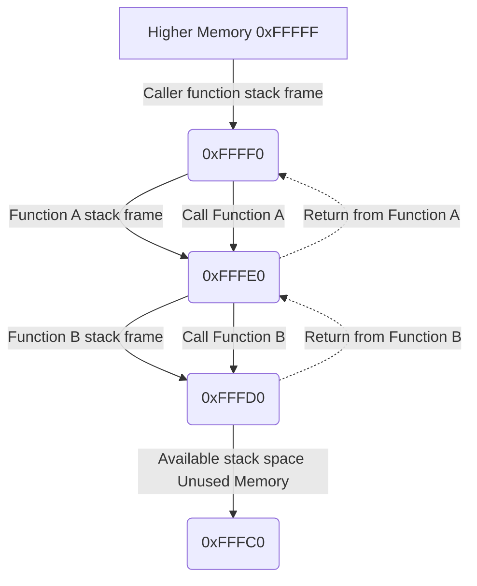

<h1 align="center">✨ Stack Obfuscator ✨</h1>

<h6 align="center"><em>High performance anti-analysis header for Windows (Kernel & User) and Linux systems</em></h6>

## 📝 Overview

[Stack-Obfuscator.hpp](./include/Stack-Obfuscator.hpp) is a header-only C++ library for Windows (user & kernel mode) and Linux systems that helps protect critical functions in your program from reverse engineering, heuristic detection, static detection and much more. It works by temporarily encrypting function return addresses on the stack during execution making it significantly harder for all analysis tools to trace the execution flow of your program. Further, it also proxies external calls your program makes essentially masking any external behavior you might be doing. No system call or API call will point from or back to your program.

> [!IMPORTANT]
> This project is primarily intended for protection or learning purposes, while it can easily be used for maliscious reasons, its purpose is not that.
>
> Please consider using this library with other security solutions for more comprehensive protection.

## ✨ Features

### 🔒 Security & Protection
- **Stack obfuscation**
- **Return address protection**
- **Cryptographically secure key generation**
- **Anti-tampering detection**
- **Cross-platform CFI/CFG controls**
- **Entropy quality validation**
- **Stack corruption detection**

### 🚀 Performance & Efficiency
- **Zero allocation performance overhead**
- **Aggressive compiler inlining**
- **Hardware-accelerated**
- **Compile-time optimization**

### 🌐 Cross-Platform
- **Cross compiler support: MSVC, GCC, Clang**
- **Multi-architecture support: x64, x86, ARM64**
- **Platform-native optimizations: Windows, Linux**
- **ABI-aware calling conventions: Microsoft ABI, System V ABI**
- **Complete calling convention coverage**

### 🔧 Advanced Features
- **Kernel and user mode support with unified API**
- **Windows kernel driver compatibility**
- **Xoshiro256 PRNG encryption**

## 🚀 Installation

### 🛠 Requirements

#### 📋 Core Requirements
- **C++20 or above** (required for all platforms)

#### 🖥️ Supported Compilers
- **Microsoft Visual C++** (MSVC 2019 16.8+)
- **Clang** (7.0+)
- **GCC** (9.0+)

#### 🌐 Supported Platforms
- **Windows 10 or above**
- **Linux**
- **Windows Kernel Mode**

#### 🏗️ Architecture Support
- **x86-64** (primary target, full feature support)
- **x86** (32-bit, limited testing with warnings)
- **ARM64** (AArch64, full feature support)

#### ⚙️ Build Configuration Notes
- **Vectorcall support**: Use Clang instead of GCC (GCC lacks vectorcall support)
- **Kernel mode**: Requires Windows Driver Kit (WDK) and appropriate kernel headers
- **CFI support**: Clang with `-fsanitize=cfi -flto` for enhanced control flow integrity
- **CET support**: GCC 9+ or Clang 7+ with `-fcf-protection` for Intel CET

### 🌌 Implementation

This module is a header-only implementation, simply include [Stack-Obfuscator.hpp](./include/Stack-Obfuscator.hpp) in your project:

```cpp
#include "Stack-Obfuscator.hpp"
```

## 💻 Usage

### 📚 Examples

_**Obfuscating a function:**_

```cpp
void foo(void)
{
	OBFUSCATE_FUNCTION;
	// Rest of the code...
}
```

_**Proxying external calls:**_

```cpp
// Basic
OBFUSCATE_STDCALL(void, Sleep)(1000);

// Return value
DWORD result = OBFUSCATE_STDCALL(DWORD, GetCurrentProcessId)();

// Kernel mode function
OBFUSCATE_STDCALL(void, KeMemoryBarrier)();

// Other calling convention
OBFUSCATE_CDECL(void*, memcpy)(dst, src, n);

// Object methods
MyClass object;
auto result = OBFUSCATE_THISCALL(void, object.function)()
```

_**Call using a function pointer:**_

```cpp
void (WINAPI* SleepPtr)(DWORD dwMilliseconds) = &Sleep;
OBFUSCATE_STDCALL(void, SleepPtr)(1000);
```

### 🌐 API

#### The header's API is primarily macro based:

| Definition | Description |
|------------|-------------|
| `OBFUSCATE_FUNCTION` | Obfuscates a function's return address with automatic cleanup |
| `OBFUSCATE_CDECL(ret, name)` | Obfuscate a `cdecl` calling convention function call (Default C convention) |
| `OBFUSCATE_STDCALL(ret, name)` | Obfuscate a `stdcall` calling convention function call (Windows API/NTAPI) |
| `OBFUSCATE_FASTCALL(ret, name)` | Obfuscate a `fastcall` calling convention function call (x86 32-bit only) |
| `OBFUSCATE_THISCALL(ret, name)` | Obfuscate a `thiscall` calling convention function call (C++ member functions) |
| `OBFUSCATE_VECTORCALL(ret, name)` | Obfuscate a `vectorcall` calling convention function call (Windows, Clang only) |
| `OBFUSCATE_CLRCALL(ret, name)` | Obfuscate a `clrcall` calling convention function call (.NET managed code) |
| `OBFUSCATE_MICROSOFT_ABI(ret, name)` | Obfuscate using Microsoft ABI (Cross-platform Windows compatibility) |
| `OBFUSCATE_LINUX_ABI(ret, name)` | Obfuscate using System V ABI (Unix/Linux native calling convention) |
| `OBFUSCATOR_LAST_STATE` | Get the last internal library operation status |

#### Windows Kernel specific:

| Definition | Description |
|------------|-------------|
| `REGISTER_OBFUSCATOR_THREAD_CLEANUP` | Register kernel thread lifecycle cleanup handler |
| `UNREGISTER_OBFUSCATOR_THREAD_CLEANUP` | Unregister kernel thread lifecycle cleanup handler |
| `ALLOW_TLS_OVERWRITE` | Allow the library to override the thread's local storage (Required for state management) |
| `LAST_THREAD_STATE` | Latest library specific thread initialization and lifecycle state |
| `OBFUSCATOR_TLS_OFFSET` | The library's thread local storage structure size offset |

#### Status Codes Reference:

##### ObfuscateStatus

Enum type representing the internal library state codes.

| Value | Description |
|-------|-------------|
| SUCCEEDED | Operation completed successfully |
| INITIALIZED | Obfuscation has been properly initialized |
| PENDING_CALL | Obfuscated function is waiting to be called |
| UNINITIALIZED_TLS | Thread Local Storage has not been initialized |
| INVALID_ENCRYPTION | Encryption is invalid or corrupted |
| INVALID_FUNCTION_ADDRESS | Function pointer address is invalid |
| WEAK_ENCRYPTION_FALLBACK | Secure encryption failed, using fallback method |
| CORRUPT_KEY_OR_STACK_ADDR | Encryption key or stack address is corrupted |
| INVALID_CALLING_CONVENTION | Function calling convention is incompatible |
| UNINITIALIZED_STACK_CLEANUP | Stack cleanup procedure not initialized |

##### LastThreadStatus

Enum type representing the internal library thread state (Kernel-mode only).

| Value | Description |
|-------|-------------|
| INIT_SUCCESS | Thread initialization completed successfully |
| INIT_FAILURE | Thread initialization failed |
| THREAD_TERMINATED | Thread has been terminated |
| THREAD_IS_CREATING | Thread is in creation process |
| THREAD_IS_TERMINATING | Thread is in termination process |
| UNINITIALIZED_GLOBAL | Global thread variables not initialized |

### ⭐ Best Practices

#### 🔒 Core Usage
- Call `OBFUSCATE_FUNCTION;` at the start of sensitive functions for automatic return address protection
- Obfuscate all external calls to ensure maximum stack protection coverage
- Use the correct calling convention macro to avoid undefined behavior (e.g., `OBFUSCATE_STDCALL` for Windows API/NTAPI)
- Verify operation success using `OBFUSCATOR_LAST_STATE == ObfuscateStatus::SUCCEEDED`
- Avoid storing proxy call objects - call obfuscated functions directly for optimal security

#### 🧵 Threading & Concurrency
- Use thread-safe initialization patterns when working with multi-threaded applications
- Each thread automatically gets unique encryption keys - no manual coordination needed
- Monitor `LAST_THREAD_STATE` in kernel mode to ensure proper thread initialization

#### 🔧 Windows Kernel Mode Specific
- Call `REGISTER_OBFUSCATOR_THREAD_CLEANUP;` in your driver entry point or thread creation routine
- Call `UNREGISTER_OBFUSCATOR_THREAD_CLEANUP;` during driver unload for proper cleanup
- Ensure `ALLOW_TLS_OVERWRITE` is enabled before using kernel mode features
- Use `baseTlsPtr + OBFUSCATOR_TLS_OFFSET` for calculating kernel mode TLS storage locations
- Monitor kernel mode status through `LAST_THREAD_STATE` for debugging and validation

#### 🌐 Cross-Platform Development
- Use `OBFUSCATE_MICROSOFT_ABI` on Linux when calling Windows-compatible functions (Wine/CrossOver)
- Use `OBFUSCATE_SYSV_ABI` for explicit Unix/Linux native calling convention adherence
- Use Clang instead of GCC when `vectorcall` support is required

#### 🏗️ Architecture & Performance
- Combine multiple protection methods for defense-in-depth security
- Place `OBFUSCATE_FUNCTION` early in functions to maximize protection coverage
- Use appropriate calling convention macros to maintain ABI compatibility
- Leverage compiler optimizations - the library is designed for aggressive inlining
- Monitor entropy quality through status codes and handle `WEAK_ENCRYPTION_FALLBACK` appropriately

#### 🐛 Debugging & Validation
- Check `OBFUSCATOR_LAST_STATE` after critical operations for error detection
- Use debug builds to enable frame pointer validation warnings
- Monitor for `CORRUPT_KEY_OR_STACK_ADDR` status which indicates potential attacks
- Validate return address integrity in security-critical applications

## 🧪 Proof of Concept

Using the following code example:

```cpp
#include "Stack-Obfuscator.hpp"

// Avoid `foo` being optimized out
#pragma optimize("", off)

void foo(void)
{
	OBFUSCATE_FUNCTION;
	return;
}

int main(void)
{
	foo();
	return 0;
}
```

Assume `OBFUSCATE_FUNCTION` is inserted/removed between examples:

| Normal Execution | Obfuscated Execution |
|------------------|----------------------|
|||

## 🔧 Technical Design & Learning

### Foundation

At its core, the functionality is based on obfuscating critical aspects of the stack frame, particularly the return addresses, while providing comprehensive cross-platform and cross-ABI compatibility.

When a function is called, it is pushed to the top of the call stack where the stack frame is allocated. The stack frame represents a function call in a program's execution. Once the function returns, the stack frame is deallocated and popped from the call stack. The call stack is a data structure that controls the execution flow of a program.

These are critical structures to a program's execution flow which analysis tools use to understand program behavior. By obfuscating key components of this structure, we prevent static and dynamic analysis while maintaining full functionality across different platforms and calling conventions.

The stack grows backwards, expanding from higher memory addresses to lower memory addresses as new stack frames are added:


<br>

When calling a function, the stack pointer behavior varies by architecture and calling convention:

```asm
; x86-64 System V ABI (Linux)
push rbp         ; Save caller's base pointer
mov rbp, rsp     ; Set new base pointer
sub rsp, 32      ; Allocate local variables (stack moves down)
; Function executes...
mov rsp, rbp     ; Restore stack pointer
pop rbp          ; Restore caller's base pointer
ret              ; Return to caller

; x86-64 Microsoft ABI (Windows)
push rbp         ; Save caller's base pointer
mov rbp, rsp     ; Set new base pointer
sub rsp, 40      ; Different alignment requirements
; Function executes...
add rsp, 40      ; Restore stack pointer
pop rbp          ; Restore caller's base pointer
ret              ; Return to caller
```

### Cross-Platform Architecture & ABI Support

The library implements comprehensive support for multiple
ABIs to ensure compatibility across platforms:

**Microsoft ABI (Windows)**: Native Windows calling conventions with proper
parameter passing and stack management

**System V ABI (Unix/Linux)**: POSIX-compliant calling conventions for
Unix-like systems

**Cross-ABI Compatibility**: Ability to use the Microsoft ABI on linux
(Wine/CrossOver compatibility) and explicit System V ABI selection

This dual-ABI approach enables the library to work seamlessly in cross-compilation
scenarios and mixed-platform environments, providing enterprise-grade portability.

### Advanced Encryption & Entropy Management

**User-Mode Encryption**: Utilizes the standard library's `std::random_device` and
`std::mt19937_64` for cryptographically secure key generation. Each thread maintains
unique keys with automatic entropy validation.

**Kernel-Mode Encryption**: Implements a custom xoshiro256 PRNG with multiple
entropy sources:

- High-resolution timestamp
- Performance counter queries
- Process and thread identifiers
- System time (temporal entropy)
- Additional entropy injection during key generation

**Entropy Quality Validation**: Multi-layered entropy verification including:

- Bit distribution analysis using hardware `popcount` instrictions (for CPUs past 2007)
- Pattern detection for weak keys (repeated bytes, arithmetic progressions)
- Fallback mechanisms for systems without hardware popcount support
- Automatic weak key rejection with status reporting

### Frame Pointer Management & Return Address Protection

The library implements sophisticated frame pointer detection and validation:

**Cross-Platform Frame Pointer Access:**

- **x86-64**: Uses the `%rbp` register
- **x86**: Uses the `%ebp` register with 32-bit considerations
- **ARM64**: Uses the `x29` frame pointer register

**Frame Pointer Validation**: Runtime heuristic verification ensuring:

- Frame pointer is above stack pointer (proper stack direction)
- Reasonable stack frame sizes (preventing corruption detection)
- Proper pointer alignment for the target architecture
- Debug-mode runtime warning for invalid frame pointer configurations

### Enhanced Calling Convention Support

The library provides comprehensive calling convention support with proper ABI adherence:

**Traditional Calling Conventions**:
- `cdecl`: The standard C calling convention with caller stack cleanup
- `stdcall`: Windows API calling convention with callee stack cleanup
- `fastcall`: Register-based parameter passing (x86 32-bit)
- `thiscall`: C++ member function calling convention (passing the 'this' pointer)
- `vectorcall`: SIMD-optimized calling convention (Clang/MSVC only)

**ABI-Specific Conventions**:
- `ms_abi`: The standard Microsoft ABI convention for cross-platform Windows compatibility
- `sysv_abi`: The standard System V ABI convention for ELF-based Unix/Linux native compatibility

**Graceful Degradation**: Automatic handling of unsupported features such as
compiler convention limitations, with appropriate fallbacks.

### Template Metaprogramming & Compile-Time Optimization

The library employs extensive compile-time optimization through template metaprogramming:

**Custom STL Implementation**: Complete reimplementation of STL components for
kernel mode:

- `remove_reference` and `remove_reference_t` for type reference manipulation
- Perfect forwarding implementation with `forward()` function templates
- `is_same` type trait for compile-time type comparison
- `is_lvalue_reference_v` for reference type detection

**Constexpr Optimization**: Aggressive use of the `constexpr` keyword for compile-time evaluation:

- Calling convention selection at compile time
- Return type determination through template specialization
- Compile-time constant propagation for performance optimization

**Static Assertions**: Comprehensive compile-time validation:

- Type safety verification for template parameters
- Platform compatibility checks
- Calling convention compatibility validation

### Thread Safety & Memory Management

**Zero-Allocation Design**: The library operates entirely within stack boundaries
with no heap allocations, eliminating memory leak possibilities and improving cache
locality.

**Thread-Local Encryption**: Each thread maintains an independent encryption state:

- **User Mode**: Thread-local storage for key management and state tracking
- **Kernel Mode**: Custom TLS implementation using the Thread Environment Block (TEB)

**Kernel Mode TLS Management**:

- Direct TEB access using undocumented Windows kernel structures
- Custom TLS slot management with proper size validation
- Thread lifecycle integration with kernel thread notification callbacks
- Appropriate Thread State padding and packing ensuring safely aligned memory

**Synchronization Primitives**:

- Spinlock protection for critical kernel mode state changes
- Lock-free design for performance-critical paths
- Memory barrier placement ensuring correct accessing order

### Security Mechanisms & Anti-Tampering

**Return Address Verification**: Multi-stage verification of return address integrity:

- Null pointer detection with immediate termination
- Address range validation for stack corruption detection
- Cryptographic verification of restored addresses

**Anti-Analysis Techniques**:

- XOR encryption of return addresses to break static analysis
- Dynamic key generation preventing signature-based detection
- Stack obfuscation disrupting call flow analysis
- Control flow integrity protection through CFI/CFG integration

**Immediate Termination on Compromise**:

- **Windows User Mode**: `__fastfail()` with stack cookie failure code
- **Windows Kernel Mode**: `KeBugCheckEx()` triggering a bluescreen
- **Linux**: `SIGKILL` with unreachable code directive

## ✨ Future Improvements

### Offset-Based Shellcode Caching

Because of instructions like `e8` and `e9`
which are relative jump and call instructions;
<br>
shellcode caching becomes much harder to do.
When caching, dynamic memory is allocated
<br>
for the shellcode, which in turn, will move the shellcode's
location in memory once it is ofcourse copied into the buffer.
<br>
<br>
Because of this, the `e8` and `e9` instructions' offsets
would need to be recalculated when retrieving the shellcode.
<br>
This cannot be done when caching since further cache allocations
will cause the memory to move again, and upon retrieval a loop would need to check every single byte in the shellcode and manually rewrite the relative jump instrictions.
<br>
<br>
This is ofcourse a lot of performance overhead, especially
considering that due to kernel-mode restrictions, the STL
<br>
is unavailable, so ideal containers such as `std::unordered_map`
are unavailable. Therefore, a custom hashing based container would need to be implemented.
<br>
<br>
One possible mitigation would be to mask out the bytes using bitwise operations,
and then indentifying each relative jump instruction this way.
This would allow for faster memory scanning in chunks.
<br>
<br>
Still, the performance overhead of this is unclear.
The solution I currently came up with is to implement
said hashing container, with a bytemask approach to identifying
the offsets from the start of the allocation to each relative
jump instruction, store these for retrieval, and later, upon
retrieval, manually jump to these offsets and recalculate their
relative offsets in memory.
<br>
<br>
Though, having timed the heaviest
system calls to the NT Kernel, the highest execution overhead
I timed was of 4ms. Granted, having an AMD Ryzen 9 7950x helps a bit,
but still, this performance overhead is negligible, I would need
to carefully benchmark the solution before implementing it.

### C-Style API interface
Currently, the header is only for C++ projects,
this isn't really ideal for someone working in C.
Yes, the header's functionality is C++, however,
because the API is macro based, some circumventions
can be done to support C projects.
<br>
The header would still need to be compiled via C++.

## 📃 License
This project uses the MIT License
<br>
For more info, please find the `LICENSE` file here: [License](LICENSE)
