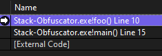
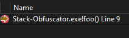
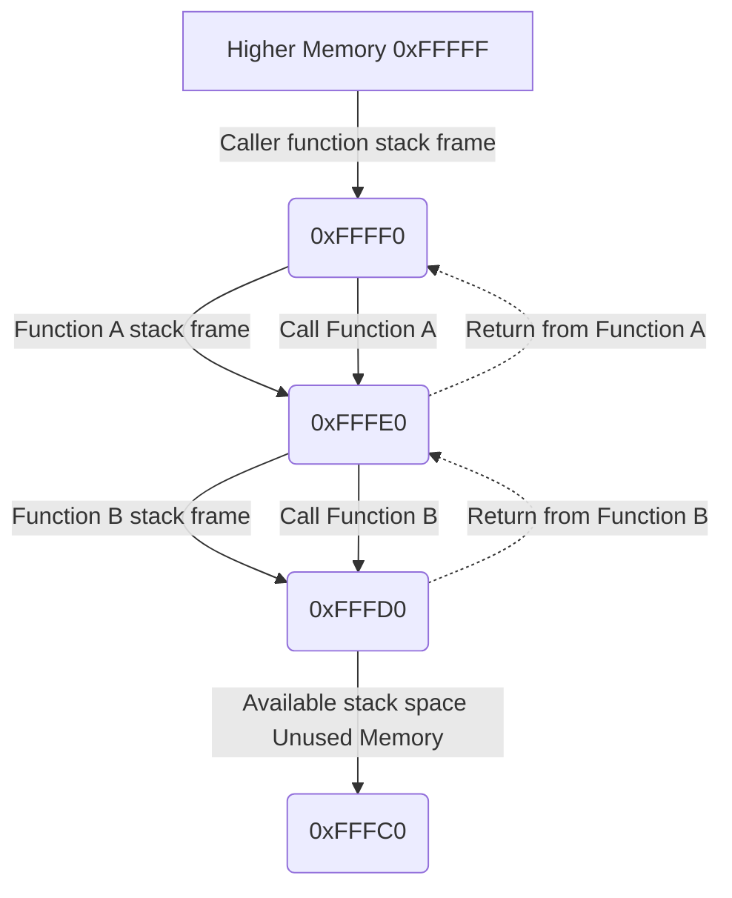
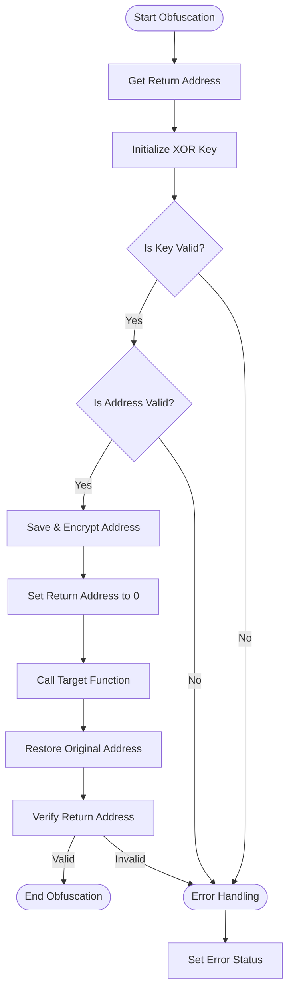
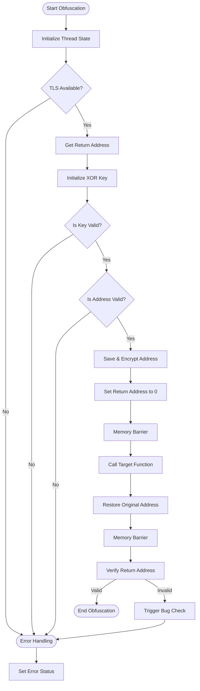

<h1 align="center">✨ Stack Obfuscator ✨</h1>

<h6 align="center"><em>High performance anti-analysis header for Windows (Kernel & User)</em></h6>

## 📝 Overview

[Stack-Obfuscator.hpp](./include/Stack-Obfuscator.hpp) is a header-only C++ library for both user mode and kernel mode that helps protect critical functions in your program from reverse engineering, heuristic detection, static detection and much more. It works by temporarily encrypting function return addresses on the stack during execution making it significantly harder for all analysis tools to trace the execution flow of your program. Further, it also proxies external calls your program makes essentially masking any external behavior you might be doing. No system call or API call will point from or back to your program.

## ✨ Features
- **Return address protection**
- **Cryptographically secure**
- **Thread safe**
- **Thread unique**
- **Multiple calling convention support**
- **Kernel & user mode support**
- **Low performance overhead**
- **No external dependencies**
- **Supports both x32 and x64**
- **Modern C++ design**
- **Thoroughly tested**
- **Zero allocation performance overhead**
- **Virtually no runtime exceptions**
- **Unique thread-local encryption management**
- **Highly optimized through compiler-time resolution**

## 🚀 Installation

### 🛠 Requirements
- MSVC Compiler
- Windows 10 or above
- C++20 support (Visual Studio 2019 16.8 or newer)

### 🌌 Implementation

This module is a header-only implementation, simply include [Stack-Obfuscator.hpp](./include/Stack-Obfuscator.hpp) in your project:

```cpp
#include "Stack-Obfuscator.hpp"
```

## 💻 Usage

### 📚 Examples

_**Obfuscating a function:**_

```cpp
void foo(void)
{
	OBFUSCATE_FUNCTION;
	// Rest of the code...
}
```

_**Proxying external calls:**_

```cpp
// Basic
OBFUSCATE_STDCALL(void, Sleep)(1000);

// Return value
DWORD result = OBFUSCATE_STDCALL(DWORD, GetCurrentProcessId)();

// Kernel mode function
OBFUSCATE_STDCALL(void, KeMemoryBarrier)();

// Other calling convention
OBFUSCATE_CDECL(void*, memcpy)(dst, src, n);

// Object methods
MyClass object;
auto result = OBFUSCATE_THISCALL(void, object.function)()
```

_**Call using a function pointer:**_

```cpp
void (WINAPI* SleepPtr)(DWORD dwMilliseconds) = &Sleep;
OBFUSCATE_STDCALL(void, SleepPtr)(1000);
```

### 🌐 API

#### The header's API is primarily macro based:

| Definition | Description |
|------------|-------------|
| `OBFUSCATE_FUNCTION` | Obfuscates a function's return address |
| `OBFUSCATE_CDECL` | Obfuscate a `cdecl` calling convention function call (Default C convention) |
| `OBFUSCATE_STDCALL` | Obfuscate a `stdcall` calling convention function call (NTAPI) |
| `OBFUSCATE_FASTCALL` | Obfuscate a `fastcall` calling convention function call (only x32) |
| `OBFUSCATE_THISCALL` | Obfuscate a `thiscall` calling convention function call (Class member calls) |
| `OBFUSCATE_VECTORCALL` | Obfuscate a `vectorcall` calling convention function call |
| `OBFUSCATE_CLRCALL` | Obfuscate a `clrcall` calling convention function call |
| `OBFUSCATOR_LAST_STATE` | The last internal library state |

#### Kernel specific:

| Definition | Description |
|------------|-------------|
| `REGISTER_OBFUSCATOR_THREAD_CLEANUP` | Register kernel thread cleanup |
| `UNREGISTER_OBFUSCATOR_THREAD_CLEANUP` | Unregister kernel thread cleanup |
| `ALLOW_TLS_OVERWRITE` | Allow the library to override the thread's local storage (Required for states) |
| `LAST_THREAD_STATE` | Latest library specific thread state |
| `OBFUSCATOR_TLS_OFFSET` | The library's thread local storage offset |

#### Status Codes Reference:

##### ObfuscateStatus

Enum type representing the internal library state codes.

| Value | Description |
|-------|-------------|
| SUCCEEDED | Operation completed successfully |
| INITIALIZED | Obfuscation has been properly initialized |
| PENDING_CALL | Obfuscated function is waiting to be called |
| UNINITIALIZED_TLS | Thread Local Storage has not been initialized |
| INVALID_ENCRYPTION | Encryption is invalid or corrupted |
| INVALID_FUNCTION_ADDRESS | Function pointer address is invalid |
| WEAK_ENCRYPTION_FALLBACK | Secure encryption failed, using fallback method |
| CORRUPT_KEY_OR_STACK_ADDR | Encryption key or stack address is corrupted |
| INVALID_CALLING_CONVENTION | Function calling convention is incompatible |
| UNINITIALIZED_STACK_CLEANUP | Stack cleanup procedure not initialized |

##### LastThreadStatus

Enum type representing the internal library thread state (Kernel-mode only).

| Value | Description |
|-------|-------------|
| INIT_SUCCESS | Thread initialization completed successfully |
| INIT_FAILURE | Thread initialization failed |
| THREAD_TERMINATED | Thread has been terminated |
| THREAD_IS_CREATING | Thread is in creation process |
| THREAD_IS_TERMINATING | Thread is in termination process |
| UNINITIALIZED_GLOBAL | Global thread variables not initialized |

### ⭐ Best Practices

- Call `OBFUSCATE_FUNCTION;` at the start of the function
- Obfuscate all external calls to ensure maximum obfuscation
- (Kernel) Call `REGISTER_OBFUSCATOR_THREAD_CLEANUP;` on driver entry or thread creation
- Use the correct calling convention macro to avoid undefined behavior (e.g. stdcall for the NTAPI)
- Using `OBFUSCATOR_LAST_STATE == ObfuscateStatus::SUCCEEDED` to verify success.
- Use `baseTlsPtr + OBFUSCATOR_TLS_OFFSET` for kernel mode TLS storage.
- Avoid storing a proxy call object, call it directly.
- Use different protection methods in combination

## 🧪 Proof of Concept

Using the following code example:

```cpp
#include "Stack-Obfuscator.hpp"

// Avoid `foo` being optimized out
#pragma optimize("", off)

void foo(void)
{
	OBFUSCATE_FUNCTION;
	return;
}

int main(void)
{
	foo();
	return 0;
}
```

Assume `OBFUSCATE_FUNCTION` is inserted/removed between examples:

| Normal Execution | Obfuscated Execution |
|------------------|----------------------|
|||

## ⚠ Limitations

- No C support (for now)
- Not foolproof, no solution ever is
- Only for Windows 10 or above and the MSVC compiler
- Manually distinguish calling convetion via macros
- Some key functions do not have Control Flow Guard (CFG) enabled
- Limited support for managed (.NET) code, not thoroughly tested

## 🔧 Technical Design & Implementation Details

### Foundation

At its core, the functionality is based off of obfuscating key aspects of the stack frame, particularly the return addresses.
<br>
When a function is called, it is pushed to the top of the call stack where then, the stack frame is allocated. The stack frame, represents a function call in a program's execution. Once the function returns, the stack frame is deallocated and it is then popped from the call stack.
<br>
The call stack is a data structure which in this context is used to control the execution flow of a program.

These are critical structures to a program's execution flow which an analysis tool uses to make sense of a program. Because we are trying to prevent this, we need to obfuscate key components to this structure, preventing analysis.
<br>
It is important to note that the stack grows backwards. Meaning, the stack expands from higher memory addresses to lower memory addresses as new stack frames are added.
<br>
We can visualize it as follows:


<br>

When calling a function, the stack pointer (`ESP` on x86) behaves as follows:

```asm
; Calling a function (stack grows downward)
push ebp         ; Save caller's base pointer
mov ebp, esp     ; Set new base pointer
sub esp, 16      ; Allocate local variables (stack moves down)
; Function executes...
mov esp, ebp     ; Restore stack pointer (stack moves up)
pop ebp          ; Restore caller's base pointer
ret              ; Return to caller
```

Based on this, we know that if two given functions `functionA` and `functionB` are called in the order of `functionA` calls `functionB`, we know that `functionB` is pushed to the top of the stack, and once it terminates execution it is popped, pushing `functionA` back to the top.

When trying to identify key points of execution, an analysis tool will need to determine how this point of execution is called, in order to determine how it is used, etc. By encrypting the return address of the function, we can essentially prevent this, as the now encrypted return address will not point to any meaningful location in memory.

A practical example of this would be to obfuscate a key execution point, such as license validation. As a basic example, we can assume the bad actor is attempting to identify this key validation step and skip it. By obufuscating the control flow of the program entirely, the bad actor is faced with a much more challenging problem in trying to identify any meaningful information.

This can also be applied to heuristic / vector detection methods, where by observing the external calls a program makes, an analysis tool can identify any potentially significant behaviors. By obfuscating the return addresses, these external calls will not point from nor back to the program, essentially voiding any attribution to the call.

### Encryption

In user-mode, the module simply uses the standard library to create a cryptographically secure key. This key is stored locally per thread, meaning that the same function will have a different key depending on the thread it is executed in. Therefore, each thread is unique from one another. On the kernel level, due to the absence of the standard library, the module uses extensive methods to improve on the cryptography's entropy, such as using unique runtime components such as the precise execution time, process id, thread id, hardware clock speed, etc. It then goes trough an efficient process to generate sufficient entropy, finally, a key is generated. If at any point the encryption is invalid, the program will come to a stop. This is to ensure that the encryption cannot be reversed engineered into a consistent result.

### Basic Obfuscation

At the most basic level, the obfuscation is performed by generating a cryptographically secure key, and applying it via an xor gate onto the return address of the stack frame. Therefore, only the caller (the library) knows the return address, restoring it once the execution is complete.

### Obfuscating Calls

In order to obfuscate external calls, we must handle the stack frame ourselves. The library wraps the function in an object, which overloads the call operator, allowing us to implement our own logic. When calling, first, the address of the function is ensured to be valid, then the shellcode for the function is generated, in such a way that it maintains the `e8` and `e9` relative jumps in place in memory. First, we must keep in mind the calling convention of the function, to ensure the responsibility of cleaning up the stack frame and avoid undefined behavior. We can then reinterpret the function's address into its own signature applying the correct calling convention.
We can then perform the raw shellcode call, before restoring the original return address and providing the correct return value, once all values are ensured to be correct, the program returns to its normal execution flow.

### Thread & Memory Safety

The libray does not make use of the heap, it only works within the bounds of the stack, therefore there is no chance for a memory leak to occur. However, to ensure correct synchronization of critical operations, particularly in the kernel where this is critical, several memory barriers are set in order to preserve any kind of compiler or runtime reordering of operations. This is highly critical to logic of the library as it deals with highly critical system structures.
<br><br>
To fully guarantee thread uniqueness, each thread is self sustainable and independent from one another. Therefore, the only synchronization required is at the kernel level, where a thread status variable is present, therefore highly explicit spinlocks and barriers are applied to ensure no race conditions are possible when setting the latest thread state.

Threads in kernel mode make efficient use of Thread Local Storage (TLS). In the kernel, the TEB (Thread Environment Block) differs from user mode, where in user mode one might access it and manage it quite easily to the publicly exposed and documented stuctures and functions. This is not the case in kernel mode, where, while available, it is undocumented and hidden. The library makes use of some specific macro definitions and reverse engineered TEB inforamtion to access TLS appropriately, where the TLS pointer is defined as `PVOID TlsSlots[0x40];` which allows us to understand its size on both x32 and x64 architectures. We can then use TLS to ensure thread independence.

### Template Metaprogramming

The library makes extensive use of compile-time determinations, this significantly reduces runtime performance overhead. Since function calls are already defined at compile time, we can transfer this information through the use of templates to key functions in the library, allowing us to determine most of the execution already at compile time. By employing the `constexpr` (constant expression) keyword, we can use the known compile-time constants to define the result of known compile time expressions.

Due to the absence of the standard library in the kernel, much of the compile time utility functions had to be rewritten to ensure valid preservation. These functions are all meta programming functions which allow us to define part of the runtime logic at compile time (e.g. return type determination, calling convention, etc.).

A critical aspect which is required to take into account, is the preservation of lvalues and rvalues. These define how expressions behave in assignment and evaluation. An lvalue is an expression taht represents an object with a persistent memory address, it's defined using the assignment operator (`=`); these have storage (location in memory). An rvalue is a temporary value that does not have a memory address. It cannot be assigned to and it is usually on the right side of an assignment. Both lvalues and rvalues can be literals or expressions.

When handling values, we must ensure that proper lvalue and rvalue states are preserved before calling the given function. If improper handling of these occurs, it is likely that the compiler will fail to interpret their types correctly. Therefore, it is critical that the forward operation occurs successfully. For this reason, extensive static assert statements (compile time assertions) are placed to ensure that no issues will occur at runtime, instead, if an issue is present, it will be detected at compile time.

## 🔍 Execution Flow Visualizations

###### _Note that these are highly simplified visualizations_

### User-Mode Visualization



### Kernel-Mode Visualization



## ✨ Future Improvements

### Offset-Based Shellcode Caching

Because of instructions like `e8` and `e9`
which are relative jump and call instructions;
<br>
shellcode caching becomes much harder to do.
When caching, dynamic memory is allocated
<br>
for the shellcode, which in turn, will move the shellcode's
location in memory once it is ofcourse copied into the buffer.
<br>
<br>
Because of this, the `e8` and `e9` instructions' offsets
would need to be recalculated when retrieving the shellcode.
<br>
This cannot be done when caching since further cache allocations
will cause the memory to move again, and upon retrieval a loop would need to check every single byte in the shellcode and manually rewrite the relative jump instrictions.
<br>
<br>
This is ofcourse a lot of performance overhead, especially
considering that due to kernel-mode restrictions, the STL
<br>
is unavailable, so ideal containers such as `std::unordered_map`
are unavailable. Therefore, a custom hashing based container would need to be implemented.
<br>
<br>
One possible mitigation would be to mask out the bytes using bitwise operations,
and then indentifying each relative jump instruction this way.
This would allow for faster memory scanning in chunks.
<br>
<br>
Still, the performance overhead of this is unclear.
The solution I currently came up with is to implement
said hashing container, with a bytemask approach to identifying
the offsets from the start of the allocation to each relative
jump instruction, store these for retrieval, and later, upon
retrieval, manually jump to these offsets and recalculate their
relative offsets in memory.
<br>
<br>
Though, having timed the heaviest
system calls to the NT Kernel, the highest execution overhead
I timed was of 4ms. Granted, having an AMD Ryzen 9 7950x helps a bit,
but still, this performance overhead is negligible, I would need
to carefully benchmark the solution before implementing it.

### Performance Critical Discards
Because of some performance overhead with some features, like
status codes, a possible upgrade would be a compilation target
which discards possibly redundant features,
in an attempt to improve performance.

### C-Style API interface
Currently, the header is only for C++ projects,
this isn't really ideal for someone working in C.
Yes, the header's functionality is C++, however,
because the API is macro based, some circumventions
can be done to support C projects.
<br>
The header would still need to be compiled via C++.

### AntiDebug Measures
This header helps with protecting against analysis, however,
no solution is ever foolproof. I will create an AntiDebug
header as well, which will critically improve security standards.
<br>
The header won't be implemented here, as its a whole new project.
<br>
Instead, I will add a link to it here, once its made: [AntiDebug](https://github.com/Arty3/Anti-Debug)

## 📃 License
This project uses the `GNU GENERAL PUBLIC LICENSE v3.0` license
<br>
For more info, please find the `LICENSE` file here: [License](LICENSE)
